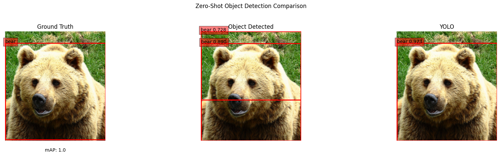
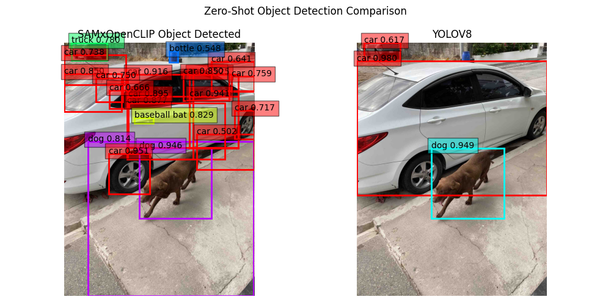

# Project 1: Zero-Shot Object Detection Using Segment Anything Model(SAM)
SAM is a new model that can basically segment anything in an image. It accepts prompts: points, bounding boxes, masks and/or text. The output is mask segmentation. 

In this project, the aim is to use SAM to perform zero-shot object detection using COCO 2017 val split. 

First of, download Segment Anything Model(SAM) checkpoints in [SAM Repository](https://github.com/pjohnden/segment-anything#model-checkpoints) and the COCO 2017 validation dataset(both images and anotations) in the [COCO website](https://cocodataset.org/#download). 

## Environment Set-up
To replicate the environment, you can use `pip install -r requirements.txt`. It is a combination of the `requirements.txt` found in [Deep-Learning-Experiments](https://github.com/roatienza/Deep-Learning-Experiments/tree/master) and [mlops](https://github.com/roatienza/mlops). Additional installation includes `opencv-python-headless` for working in HPC and `git+https://github.com/facebookresearch/segment-anything.git` for using the SAM model. `ipykernel`, `ipywidgets`,  `pytorch-lightning`  and `torchmetrics` are also installed. 

To assure proper implementation of the scripts, the following directory arrangement is suggested:
* images
  * aki_dog.jpg  
    ...
* coco2017
  * annotations
    * instances_val2017.json  
    ...
  * val2017
    * 000000000139.jpg  
    ...
* mcheckpoints
  * sam_vit_b_01ec64.pth
  * sam_vit_h_4b8939.pth
  * sam_vit_l_0b3195.pth
* outputs_sample
* test_log
* project1_sam_demo.ipynb
* project1_sam_val.py

## SAMxOpenCLIP Zero-Shot Object Detection Demonstration
A demonstration of the SAMxOpenCLIP object detection system can be accessed through `project1_sam_demo.ipynb`. An image from the COCO 2017 val split can be used or an image can be uploaded or linked through url. These are compared to the ground-truth and the YOLOV8 detection results whenever possible.

An example using one of COCO 2017 val split (Sam_b, filter threshold=0.6): 

An example using an uploaded image (Sam_b, filter threshold=0.5): 

## SAMxOpenCLIP Object Detection System Test Run
Two comprehensive validation/test runs were successfully made using `project1_sam_val.py`, the details are below:
* **First Run:**
  * SAM Model: Sam_h
  * Filter Score Threshold: 0.6
  * Images Accounted: 4952
  * Images Unaccounted (Error): 48
  * mAP @ (IoU=0.50:0.95): 0.05132187976360979
  * Execution Time: 159330.98652291298 seconds (~44hrs)
* **Second Run:**
  * SAM Model: Sam_h
  * Filter Score Threshold: 0.5
  * Images Accounted: 4952
  * Images Unaccounted (Error): 48
  * mAP @ (IoU=0.50:0.95): 0.05106421241657821
  * Execution Time: 173311.92728114128 seconds (~48hrs)

## Comments/Recommendations
As the name suggests, the Segment Anything Model(SAM) does segments everything. A bedsheet is segmented into its individual patches and a person may be segmented into its upper and lower halves. This becomes a challenge when it is used in an object detection system since it often fails to see the bigger picture and as a result, it often mislabel items. In this project, subsets of bounding boxes were considered but only if it is given the same label. No algorithm was developed to try combining masks to maximize the confidence score associated with the label a resulting bounding box receives. To further optimze this system, the development of this algorithm might be a solution. It can also be tested if the incorporation of SAM Predictor to generate better masks and better bounding boxes will yield better results.

